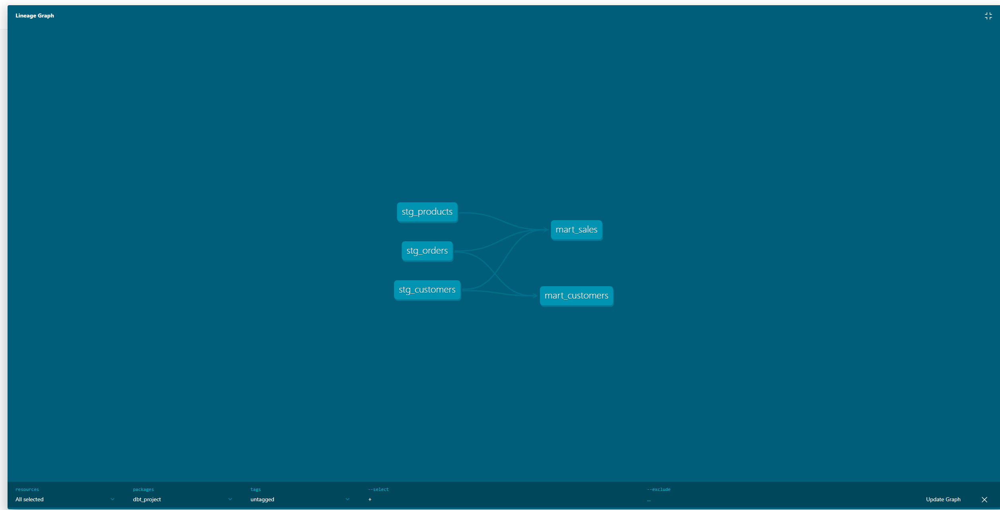

# ELT Data Warehouse

## Live Demo
[View Live Dashboard](https://elt-data-warehouse.streamlit.app/)

## Architecture
REST APIs / CSV / SQLite DB -> Python Ingestion -> DuckDB Warehouse (raw -> staging -> marts) -> dbt Transformations + 24 Data Quality Tests -> Streamlit Dashboard

## Tech Stack
- Ingestion: Python, REST APIs, Faker
- Warehouse: DuckDB
- Transformation: dbt (3 staging + 2 mart models)
- Data Quality: 24 dbt tests
- Dashboard: Streamlit + Plotly

## Project Structure
- ingestion/api_extractor.py - Pulls data from REST APIs
- ingestion/csv_loader.py - Loads and cleans CSV files
- ingestion/db_extractor.py - Extracts from SQLite database
- dbt_project/models/staging/ - 3 staging models (views)
- dbt_project/models/marts/ - 2 mart models (tables)
- storage/warehouse.py - DuckDB warehouse setup
- dashboard/app.py - Streamlit dashboard

## dbt Lineage Graph

## How to Run Locally

Clone the repo:
git clone https://github.com/saimanjunathk/elt-data-warehouse

Create virtual environment:
python -m venv venv
venv\Scripts\activate

Install dependencies:
pip install -r requirements.txt

Run the dashboard:
streamlit run dashboard/app.py

## Status
- Ingestion Layer - Done
- DuckDB Warehouse - Done
- dbt Transformations - Done
- 24 Data Quality Tests - Done
- Live Dashboard - Done
- Airflow Orchestration - Coming Soon